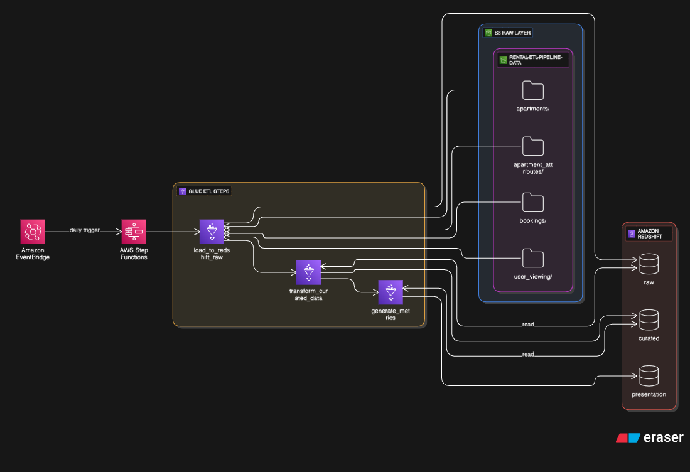

# Rental Marketplace ETL Pipeline

This project implements a cost- and compute-efficient **batch ETL pipeline** for a rental marketplace, using Amazon Aurora, AWS Glue, Amazon Redshift, Amazon S3, and AWS Step Functions.

---



## Architecture Overview

| Component             | Service             | Purpose                                          |
|----------------------|---------------------|--------------------------------------------------|
| Source Database       | Amazon Aurora MySQL | Stores raw transactional data                    |
| Landing Zone          | Amazon S3           | Raw CSV and Parquet data ingestion               |
| Transformation Engine | AWS Glue            | Data extraction, cleansing, transformation       |
| Data Warehouse        | Amazon Redshift     | Stores raw, curated, and metrics data            |
| Orchestration         | AWS Step Functions  | Manages multi-step Glue job executions           |

---

## Project Structure

```
glue_etl_project/
├── extract_from_aurora.py         # Loads CSV data from local to Aurora
├── load_to_redshift_raw.py        # Loads raw CSVs from S3 to Redshift raw schema
├── transform_curated_data.py      # Transforms raw data to curated and stores in Parquet
├── generate_metrics.py            # Aggregates metrics into presentation layer
└── README.md                      # This documentation
```

---

## ETL Job Descriptions


### 1. `extract_from_aurora.py`

- Inserts local CSV files into Aurora MySQL (`apartments`, `bookings`, etc.)
- Uses `mysql-connector-python`
- Define file-to-table mapping at the bottom
- Run locally with Python 3:
  ```bash
  python extract_from_aurora.py
  ```

### 2. `load_to_redshift_raw.py`

- Reads CSVs from `s3://rental-etl-pipeline-data/raw/<table>/`
- Loads them into `raw.<table>` schema in Redshift
- Uses AWS Glue DynamicFrame + Redshift connection

### 3. `transform_curated_data.py`

- Reads from Redshift `raw` schema using Spark SQL
- Cleans, filters, and transforms data
- Writes outputs in **Parquet format** to S3 at:
  ```
  s3://rental-etl-pipeline-data/curated/<table>/

  ```


### 4. `generate_metrics.py`

- Reads curated data
- Generates metrics for:
  - Average Listing Price (weekly)
  - Monthly Occupancy Rate
  - Repeat Customer Rate
- Saves results to `presentation` schema in Redshift

---

## 🔁 Orchestration with Step Functions

### State Machine Definition

```json
{
  "StartAt": "ExtractFromAurora",
  "States": {
    "ExtractFromAurora": {
      "Type": "Task",
      "Resource": "arn:aws:states:::glue:startJobRun.sync",
      "Parameters": { "JobName": "extract_from_aurora" },
      "Next": "LoadToRedshiftRaw"
    },
    "LoadToRedshiftRaw": {
      "Type": "Task",
      "Resource": "arn:aws:states:::glue:startJobRun.sync",
      "Parameters": { "JobName": "load_to_redshift_raw" },
      "Next": "TransformCuratedData"
    },
    "TransformCuratedData": {
      "Type": "Task",
      "Resource": "arn:aws:states:::glue:startJobRun.sync",
      "Parameters": { "JobName": "transform_curated_data" },
      "Next": "GenerateMetrics"
    },
    "GenerateMetrics": {
      "Type": "Task",
      "Resource": "arn:aws:states:::glue:startJobRun.sync",
      "Parameters": { "JobName": "generate_metrics" },
      "End": true
    }
  }
}
```


---

## S3 Folder Layout

```
s3://rental-etl-pipeline-data/
├── raw/
│   ├── apartments/
│   ├── apartment_attributes/
│   ├── bookings/
│   └── user_viewing/
├── curated/
│   ├── apartments/
│   └── bookings/
└── temp/         # Used for Redshift staging
```

---

## Testing & Validation

- ✅ Can connect to Aurora from local or EC2
- ✅ Glue jobs load correctly into Redshift
- ✅ Parquet files are saved to S3 in curated layer
- ✅ Step Function runs end-to-end successfully

---

## Security & Access

- Aurora security group must allow port 3306 from trusted IPs
- IAM roles:
  - `glue-etl-role`
  - `stepfunctions-glue-role`
- Redshift connection: `redshift-conn` must exist in Glue

---

## Notes

- Parquet used for optimized storage and query performance
- Curated data is decoupled from Redshift and available in S3
- You can extend this by adding QuickSight dashboards or Athena queries

---

## Requirements

- Python 3.x
- pandas
- mysql-connector-python
- AWS Glue and Redshift setup in AWS Console

---

## Support

Maintainer: Kwame 

Location: Ghana
  
Contact: aws-data-team@gmail.com

---